# Hochzeitstaguhr

## Motivation

Wenn ein Nerd von einem Nerd zu dessen Hochzeitstagjubiläum eingeladen wird, muss auch ein entsprechendes Mitbringsel her! Nach kurzem Überlegen bei einem Check der nutzlos rumliegenden Hardwarebestände, ist die Idee zu dieser Uhr entstanden.

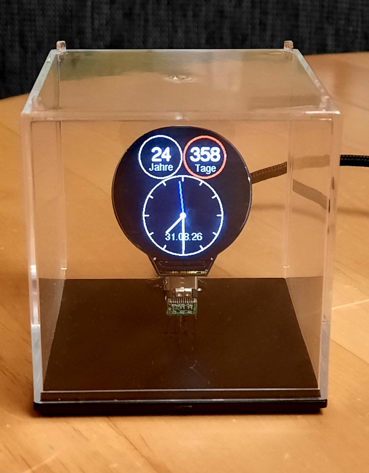
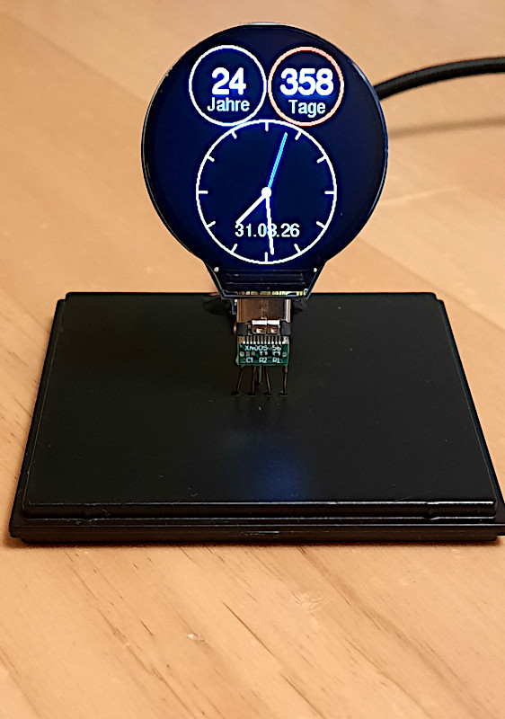
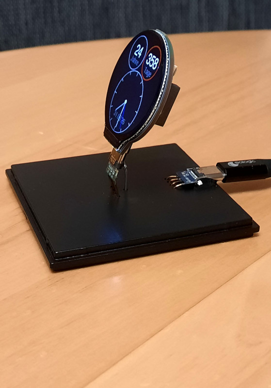

## Die Uhr

### Hardware

Als Hardware wurde dieses [runde Display](https://www.waveshare.com/esp32-s3-lcd-1.28.htm) ausgewählt. Das Ding enthält u.a. folgende Komponenten, die dann auch in diesem Projekt verwendet werden:

- ein rundes LCD mit einer Auflösung von 240x240 Pixel, welches auch RGB-Farben darstellen kann; die Hintergrundbeleuchtung kann man selbst steuern

- ein ESP32-S3, also WLAN-fähig

- einen QMI8658-IC (3-Achsen-Gyroscope und -Accelerometer)

Auf der Leiterplatte befinden sich noch zwei Button (RESET, BOOT). Letzterer ist mit GPIO-0 des ESP32 verbunden und wird auch in diesem Projekt benutzt.

Weiterhin befindet sich ein Anschluß für einen handelsüblichen Lithuim-3,7V-Akku (z.B. mit einer Kapazität von 1100mAh) samt Lade-Elektronik auf der Platine. Der Akku kann über den USB-Typ-C-Buchse aufgeladen werden. Damit könnte die Uhr also auch autonom, allerdings nur für ein paar Stunden, ohne Netzteil betrieben werden.

### Software

#### Überblick Funktionaliäten

Folgende Funktionen sind implementiert:

- Anzeige von Datum/Uhrzeit mittels eines "analogen" Ziffernblattes auf dem Display

- Anzeige von Jahren/Tagen, die seit dem (konfigurierten) Hochzeitsdatum vergangen sind

- Wenn der aktuelle Tag ein Hochzeitsjubiläumstag ist, wird der Name des Hochzeitstages (wie z.B. Silber-, Perlen-, Amberhochzeit) blinkend ausgegeben 

- mit dem BOOT-Button, auf der Rückseite des Displays, 3s gedrückt halten, kann die momentan gespeicherte WLAN-Konfiguration jederzeit gelöscht werden

- ein Gimmick (ich konnte nicht widerstehen): die Ausrichtung der Display-Ausgaben richtet sich nach der physischen Ausrichtung des Moduls

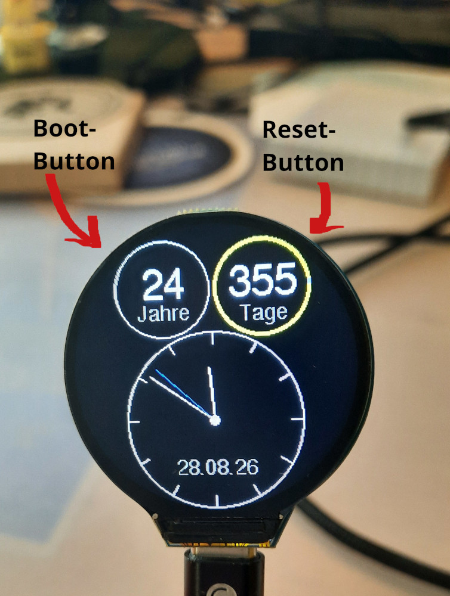

(Position der Taster auf der Rückseite des Displays)

Es wurde die Arduino-Umgebung, mit folgenden Abhängigkeiten, zur Implementierung verwendet:

```cpp
 * 
 * Arduino-IDE (für übersetzen/flashen):
 *  - Version 2.3.8
 * 
 * Board: 
 * -  Arduino‑ESP32‑Cores 3.3.10 (Espressif Systems)
 * 
 * Bibliotheken:
 * - Adafruit_GFX 1.12.6
 * - QMI8658 1.0.1
 * - WiFiMamager 2.0.17
 * - ...und deren entsprechendnen Voraussetzungen
 * 
```

#### "Konfiguration" Hochzeitsdatum

Naja, Konfiguration ist etwas übertrieben! Das Datum steht als Definition im Quelltext:

```cpp
// **********************************
// **********************************
// Hochzeitsdatum festlegen
// **********************************
// ********************************** 
#define WEDDING_DAY     11
#define WEDDING_MON     11
#define WEDDING_YEAR    2011
// **********************************
// **********************************
// **********************************
```

Theoretisch könnte man dies auch über den [WiFi-Manager variabler gestalten](https://github.com/tzapu/WiFiManager/tree/master#custom-parameters).

#### WiFi-Manager

Es handelt sich um ein Geschenk und ich kenne die WLAN-Konfiguration des Empfängers nicht. Deshalb bietet es sich an, diese Einstellungen vom Anwender, über den mit eingebundenen [WiFi-Manager](https://github.com/tzapu/WiFiManager/tree/master), erledigen zu lassen.

Folgende Schritte sind dabei zu durchzuführen:

Wenn noch nie ein WLAN konfiguriert wurde oder das zuletzt eingerichtete WLAN nicht erreichbar ist, bleibt die Uhr bei der Initialisierung in diesem Punkt stehen:

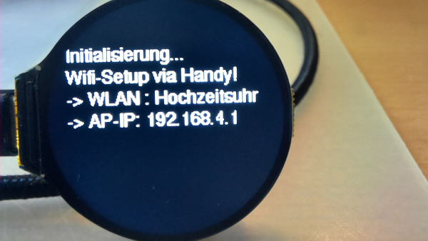

Die Uhr arbeitet dann als Accespoint mit der SSID "Hochzeitsuhr" (ohne Passwort), mit dem man sich verbinden kann:

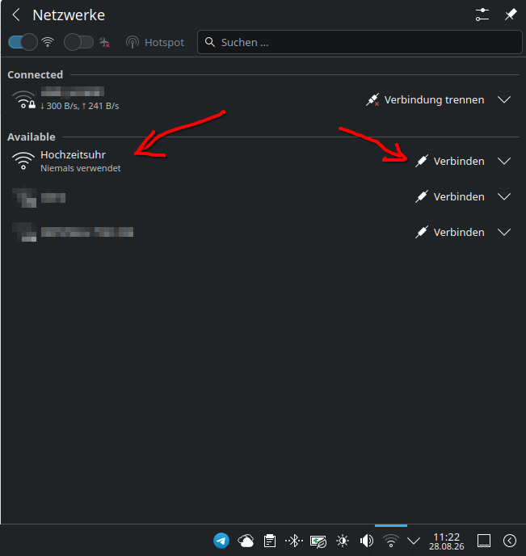

Nach erfolgreicher Anmeldung an diesem WLAN, erreicht man unter der IP-Adresse 192.168.4.1 eine Webseite, mit der man die WLAN-Verbindung konfigurieren und auf dem ESP32 entsprechend speichern kann:

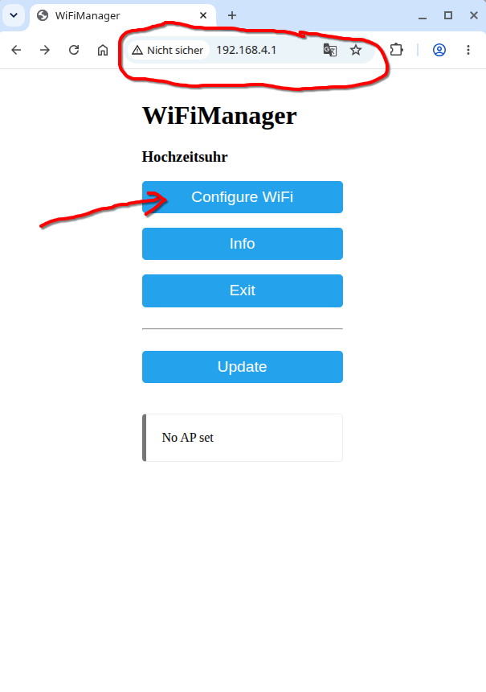
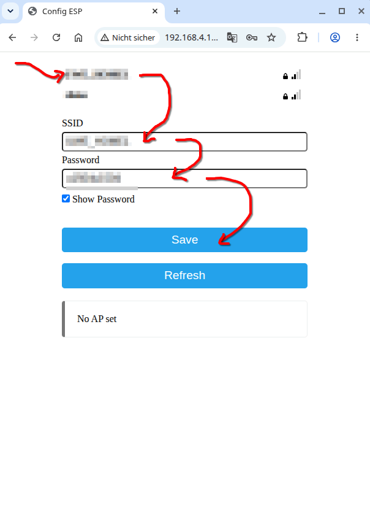
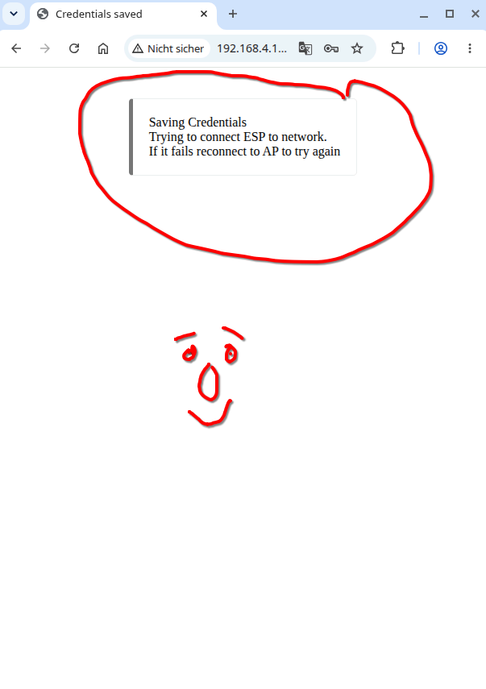

War dies erfolgreich, wird die Initialisierung der Uhr fortgesetzt:

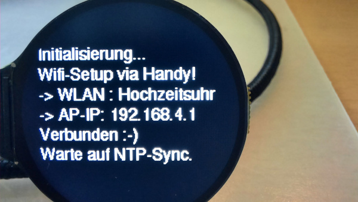

An dieser Stelle sucht die Uhr nach einem der, im Quelltext konfigurierten, NTP-Server, um dessen Datum/Uhrzeit zu übernehmen.

```cpp
    // ...SNTP konfigurieren
    sntp_setoperatingmode(SNTP_OPMODE_POLL);
    // ...mehrere NTP-Server (als Fallback)
    sntp_setservername(0, "ptbtime1.ptb.de");
    sntp_setservername(1, "ptbtime2.ptb.de");
    sntp_setservername(2, "ptbtime3.ptb.de");
    sntp_setservername(3, "de.pool.ntp.org");
    // ...NTP-Sync-Intervall
    sntp_set_sync_interval(30 * 60 * 1000);             // 30min
    // ...Smooth Sync dauerhaft aktivieren
    sntp_set_sync_mode(SNTP_SYNC_MODE_SMOOTH);
    // ... ein Callback registrieren (...aktuelle Zeit initial gesetzt)
    sntp_set_time_sync_notification_cb(time_sync_cb);
    // ...SNTP starten
    sntp_init();
```

(D.h. also auch, dass die angegebenen NTP-Server aus dem eingestellten WLAN erreichbar sein müssen!)

War dies erfolgreich, erscheint die eigentliche Ausgabe der "Hochzeitstaguhr", wie z.B.:

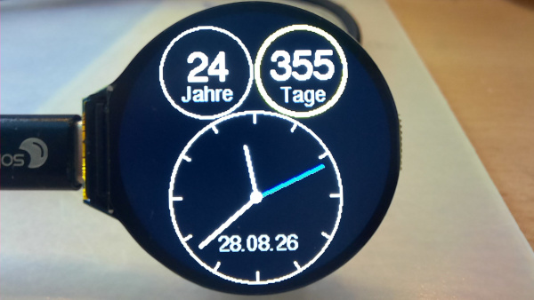

Die WLAN-Konfiguration bleibt auch nach dem Ausschalten der Uhr erhalten. Mit dem BOOT-Button (auf der Rückseite des Moduls; 3s gedrückt halten) kann die Konfiguration jederzeit gelöscht und damit, in der Folge, in den "WiFi-Manager-Modus" gesprungen werden.

---

Uwe Berger, 2026
